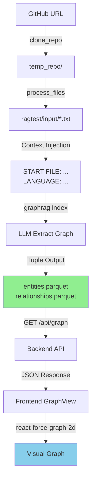

# GraphRAG Data Storage & Graph Connection - Technical Documentation

## Overview
This document explains how GraphRAG stores nodes, saves data, and connects the graph for codebase analysis.

---

## 1. Data Ingestion Flow

### Step 1: Repository Cloning
**File**: [`simple_rag_app/utils.py`](file:///c:/Users/202317/.gemini/antigravity/scratch/GrapgRagMain/simple_rag_app/utils.py#L85-L131)

```
User URL → clone_repo() → temp_repo/
```

**What Happens**:
- Git clone or ZIP download
- Extracts to `temp_repo/`

### Step 2: File Processing
**File**: [`simple_rag_app/utils.py`](file:///c:/Users/202317/.gemini/antigravity/scratch/GrapgRagMain/simple_rag_app/utils.py#L133-L200)

```
temp_repo/ → process_files() → ragtest/input/*.txt
```

**Context Injection** (Lines 191-194):
```python
header = f"START FILE: {relative_path.as_posix()}\nLANGUAGE: {lang}\n---\n"
f.write(header + content)
```

**Example Output** (`ragtest/input/src_App.js.txt`):
```
START FILE: src/App.js
LANGUAGE: js
-----------------------------------
import "./App.css";
import Dino from "./components/Dino/Dino";

function App() {
  return (
    <div className="App">
      <Dino />
    </div>
  );
}

export default App;
```

---

## 2. Entity Extraction (Graph Building)

### LLM Processing
**Workflow**: `extract_graph`
**Prompt**: [`ragtest/prompts/extract_graph.txt`](file:///c:/Users/202317/.gemini/antigravity/scratch/GrapgRagMain/ragtest/prompts/extract_graph.txt)
**Configuration**: [`ragtest/settings.yaml`](file:///c:/Users/202317/.gemini/antigravity/scratch/GrapgRagMain/ragtest/settings.yaml#L79-L83)

```yaml
extract_graph:
  entity_types: [class,function,module,variable,file,api_endpoint]
  max_gleanings: 1
```

**LLM Output Example** (Tuple Format):
```
("entity"|SRC_APP_JS|FILE|File located at src/App.js)
<record>
("entity"|APP|FUNCTION|Function App in src/App.js)
<record>
("entity"|DINO|CLASS|Class Dino imported in src/App.js)
<record>
("relationship"|SRC_APP_JS|DINO|src/App.js imports Dino|8)
<record>
("relationship"|APP|SRC_APP_JS|App is defined in src/App.js|10)
<completion>
```

---

## 3. Data Storage (Parquet Files)

### Entities Storage
**File**: `ragtest/output/entities.parquet`

| Column | Type | Example | Description |
|--------|------|---------|-------------|
| `id` | UUID | `b75c3...` | Unique identifier |
| `title` | String | `SRC_APP_JS` | **Entity Name** (used as graph node ID) |
| `type` | String | `FILE` | Entity type |
| `description` | String | `File located at src/App.js` | Full description |
| `text_unit_ids` | List | `[...]` | Source chunks |

**Critical**: The `title` field is used as the **Node ID** in the graph.

### Relationships Storage
**File**: `ragtest/output/relationships.parquet`

| Column | Type | Example | Description |
|--------|------|---------|-------------|
| `id` | UUID | `a23f1...` | Unique identifier |
| `source` | String | `SRC_APP_JS` | **Source Entity Title** |
| `target` | String | `DINO` | **Target Entity Title** |
| `weight` | Float | `8.0` | Relationship strength |
| `description` | String | `src/App.js imports Dino` | Relationship details |

**Critical**: `source` and `target` match entity `title` values.

---

## 4. Graph Connection Logic

### Backend API
**File**: [`simple_rag_app/main.py`](file:///c:/Users/202317/.gemini/antigravity/scratch/GrapgRagMain/simple_rag_app/main.py#L125-L181)

**Endpoint**: `GET /api/graph`

#### Node Construction (Lines 154-162):
```python
nodes.append({
    "id": str(row.get('title', 'Unknown')),  # Entity Title = Node ID
    "name": row.get('title', 'Unknown'),
    "type": row.get('type', 'Unknown'),
    "description": row.get('description', '')
})
```

#### Link Construction (Lines 168-179):
```python
links.append({
    "source": str(row.get('source', '')),  # Matches node.id
    "target": str(row.get('target', '')),  # Matches node.id
    "weight": float(row.get('weight', 1.0)),
    "label": label
})
```

**Example JSON Response**:
```json
{
  "nodes": [
    {"id": "SRC_APP_JS", "name": "SRC_APP_JS", "type": "FILE", "description": "File located at src/App.js"},
    {"id": "APP", "name": "APP", "type": "FUNCTION", "description": "Function App in src/App.js"},
    {"id": "DINO", "name": "DINO", "type": "CLASS", "description": "Class Dino imported"}
  ],
  "links": [
    {"source": "SRC_APP_JS", "target": "DINO", "weight": 8.0, "label": "src/App.js imports Dino"},
    {"source": "APP", "target": "SRC_APP_JS", "weight": 10.0, "label": "App is defined in src/App.js"}
  ]
}
```

---

## 5. Frontend Visualization

**File**: [`simple_rag_app/frontend/src/GraphView.jsx`](file:///c:/Users/202317/.gemini/antigravity/scratch/GrapgRagMain/simple_rag_app/frontend/src/GraphView.jsx)

**Library**: `react-force-graph-2d`

### Auto-Connection Mechanism
The library automatically connects nodes by matching:
- `link.source` → `node.id`
- `link.target` → `node.id`

**Example**:
```javascript
// Link
{source: "SRC_APP_JS", target: "DINO"}

// Nodes
[
  {id: "SRC_APP_JS", ...},  // ← Matched as source
  {id: "DINO", ...}          // ← Matched as target
]
```

---

## 6. Complete Data Flow Diagram



---

## 7. Key Design Decisions

### Why `title` as Node ID?
- **Consistency**: Relationships use entity names (not UUIDs) for `source`/`target`
- **Human Readable**: Easier debugging and visualization
- **LLM Output**: The extraction prompt generates entity names, not UUIDs

### Why Parquet?
- **Columnar Storage**: Efficient for analytics
- **Compression**: Reduces disk usage
- **Type Preservation**: Maintains data types (float, list, etc.)

### Why "Safe Names" (e.g., `SRC_APP_JS`)?
- **Regex Parser**: The `regex_english` extractor crashes on special characters (`/`, `.`)
- **Solution**: Use underscores in entity names, store real paths in descriptions

---

## 8. Troubleshooting

### Issue: Graph shows no connections
**Cause**: `link.source`/`link.target` don't match any `node.id`
**Fix**: Verify `entities.parquet` `title` column matches `relationships.parquet` `source`/`target`

### Issue: Entities missing
**Cause**: LLM output didn't match regex parser format
**Fix**: Check `indexing-engine.log` for parsing errors

### Issue: 500 Error on `/api/graph`
**Cause**: Missing `entities.parquet` or `relationships.parquet`
**Fix**: Re-run `python -m graphrag index --root ragtest`

---

## 9. Verification Commands

```powershell
# Check if artifacts exist
ls ragtest/output/*.parquet

# View entity sample
python -c "import pandas as pd; print(pd.read_parquet('ragtest/output/entities.parquet').head())"

# View relationship sample
python -c "import pandas as pd; print(pd.read_parquet('ragtest/output/relationships.parquet').head())"

# Test API
curl http://127.0.0.1:8000/api/graph
```

---

## Summary

1. **Ingestion**: Code files → `ragtest/input/*.txt` (with metadata headers)
2. **Extraction**: LLM reads files → Outputs tuples → Parsed into Parquet
3. **Storage**: `entities.parquet` (nodes) + `relationships.parquet` (edges)
4. **API**: Backend reads Parquet → Constructs JSON graph
5. **Visualization**: Frontend matches `source`/`target` to `node.id` → Renders graph
