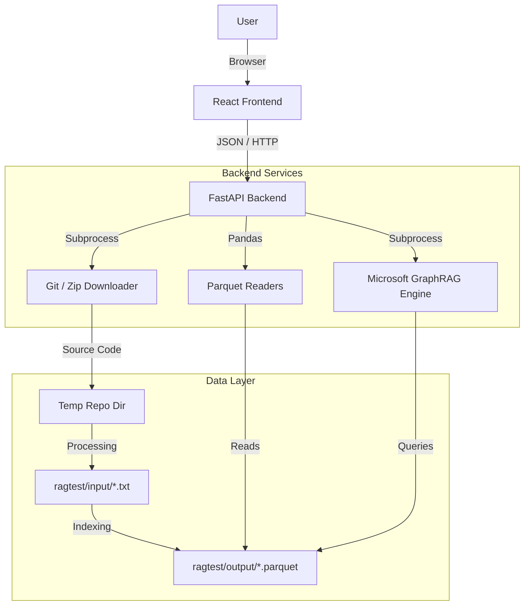

# GraphRAG Explorer Architecture

This document details the technical architecture of the **GraphRAG Explorer** application, a full-stack web interface designed to simplify the ingestion, indexing, and querying of GitHub repositories using Microsoft's GraphRAG engine.

## 1. High-Level Overview

The system follows a typical Client-Server architecture:
*   **Frontend**: A responsive Single Page Application (SPA) built with React (Vite) that handles user interactions, chat visualization, and graph rendering.
*   **Backend**: A lightweight FastAPI server that acts as an orchestration layer. It exposes REST endpoints to trigger the underlying GraphRAG CLI commands.
*   **Core Engine**: The standard **Microsoft GraphRAG** python library is used for the heavy lifting (indexing, embedding, and LLM query generation).



## 2. Component Details

### 2.1 Frontend (Presentation Layer)
*   **Framework**: React 18, bundled with Vite.
*   **Styling**: Pure CSS (Light Theme), using CSS variables for theme management. Glassmorphism design principles.
*   **Key Components**:
    *   **`App.jsx`**: Manages application state (ingestion status, chat history, active tab). Use `fetch` to communicate with the backend.
    *   **`GraphView.jsx`**: Utilizes `react-force-graph-2d` to render the Knowledge Graph. It allows interactive zooming, panning, and hovering over nodes.
    *   **`index.css`**: Contains global styles, typography (Outfit font), and high-contrast color definitions (Pure Black/White).

### 2.2 Backend (Orchestration Layer)
*   **Framework**: FastAPI (Python).
*   **File**: `simple_rag_app/main.py`
*   **Responsibilities**:
    1.  **API Gateway**: Exposes endpoints for the UI (`/api/ingest`, `/api/query`, `/api/graph`, `/api/reset`).
    2.  **Process Management**: Uses python's `subprocess` module to execute system commands. This ensures we run the official GraphRAG CLI in its own environment.
    3.  **Data Transformation**: Reads the raw Parquet output from GraphRAG using `pandas` and transforms it into a JSON node-link format for the frontend.

### 2.3 Data Processing Utilities
*   **File**: `simple_rag_app/utils.py`
*   **Repository Cloning**:
    *   **Git Method**: Tries to use the system `git` command to clone repositories.
    *   **Zip Fallback**: If `git` is missing, it uses `urllib` to download the repo as a `.zip` from GitHub and extracts it using `zipfile`.
    *   **Subdirectory Support**: Can parse URLs like `github.com/user/repo/tree/main/subdir` to only ingest specific folders.
*   **File Conversion**:
    *   Walks through the cloned code.
    *   Filters for code extensions (`.py`, `.js`, `.java`, etc.).
    *   Copies content into `ragtest/input` as flat `.txt` files (e.g., `src_components_Button.jsx.txt`), which is the format GraphRAG expects.

## 3. Data Flow

### 3.1 Ingestion Pipeline
1.  **User Input**: User provides a GitHub URL in the UI.
2.  **Clone**: Backend downloads the source code to specific temp folder.
3.  **Pre-process**: Code files are converted to text files in `ragtest/input`.
4.  **Index**: Backend triggers `python -m graphrag index`.
    *   GraphRAG chunks the text.
    *   Generates embeddings (via OpenAI).
    *   detects communities and summarizes them.
    *   Writes output to `ragtest/output`.

### 3.2 Query Pipeline
1.  **User Input**: User types a question in the Chat UI.
2.  **Execution**: Backend triggers `python -m graphrag query --method global "Question"`.
3.  **LLM Processing**: GraphRAG uses the community summaries to answer the question broadly.
4.  **Response**: The text answer is returned to the UI and displayed in the chat bubble.

### 3.3 Visualization Pipeline
1.  **Request**: UI requests `/api/graph`.
2.  **Read**: Backend uses `pandas` to open `entities.parquet` and `relationships.parquet`.
3.  **Transform**:
    *   Extracts Entity Name, Type, and Description.
    *   Extracts Source, Target, and Description for edges.
4.  **Render**: `react-force-graph-2d` draws the graph using the JSON data.

## 4. Technology Stack

| Layer | Technology | Purpose |
|-------|------------|---------|
| **Frontend** | React (Vite) | User Interface |
| **Viz Library**| react-force-graph-2d | Interactive Graph rendering |
| **Backend** | FastAPI | API Server |
| **CLI** | subprocess (Python) | Running system commands |
| **Data Handling**| Pandas / PyArrow | Reading Parquet files |
| **RAG Engine** | **Microsoft GraphRAG** | Indexing & Retrieval |
| **LLM** | OpenAI (GPT-4o/mini) | Embeddings & Text Generation |

## 5. File Structure
```text
/
├── simple_rag_app/
│   ├── frontend/         # React Application
│   │   ├── src/
│   │   │   ├── App.jsx   # Main Logic
│   │   │   ├── GraphView.jsx # Graph Component
│   │   │   └── index.css # Styling
│   ├── main.py           # FastAPI Backend
│   └── utils.py          # Cloning & Processing Logic
├── ragtest/
│   ├── input/            # Converted .txt files
│   ├── output/           # Generated Graph Artifacts
│   ├── settings.yaml     # GraphRAG Config
│   └── .env              # API Keys
```
