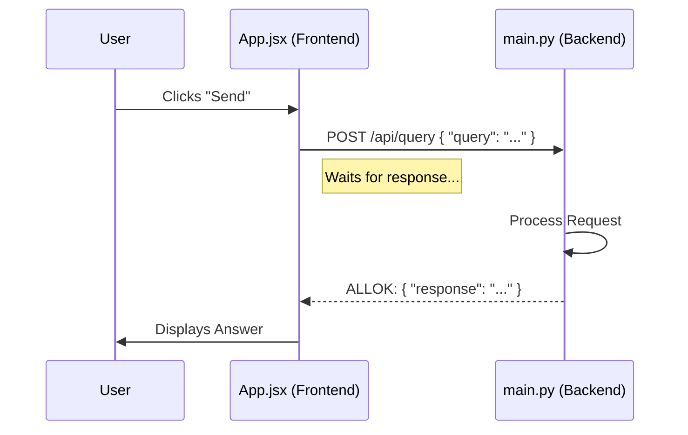

# System Internals & operational Logic

This document explains **how** the GraphRAG Explorer works under the hood, specifically focusing on the connections between components and the operational logic.

## 1. Frontend-Backend Communication
**Mechanism**: HTTP REST API (JSON)

The connection acts like a typical client-server model:
*   **Frontend (`App.jsx`)**: Acts as the requester. It collects user input (GitHub URL, Chat Query) and packages it into a JSON object. It uses the browser's `fetch()` API to send this to the backend.
*   **Backend (`main.py`)**: Acts as the listener. It uses **FastAPI** to listen on port `8000`. Specific functions are "decorated" with routes (e.g., `@app.post`) to handle specific requests.

**Visual Flow:**


---

## 2. Executing GraphRAG Commands
**Mechanism**: Python `subprocess` module

Since Microsoft GraphRAG is a Command Line Interface (CLI) tool, the backend cannot import it like a normal library function in the traditional sense for these operations. Instead, it "automates" the terminal.

*   **The Code**:
    ```python
    subprocess.run([sys.executable, "-m", "graphrag", "index", ...])
    ```
*   **Breakdown**:
    *   `sys.executable`: Points to the *current* python environment (ensuring we don't accidentally use the wrong python version installed on the system).
    *   `-m graphrag index`: Equivalent to typing this in your terminal.
    *   `capture_output=True`: The backend "reads" the text that would normally appear in your terminal window so it can send it back to the frontend.

---

## 3. Query Logic: Global vs Local
**Current Mode**: **Global Search**

The system is configured to use the **Global Search** method.

*   **Global Search**: Answers "Wait, what is this dataset about?" questions. It uses the *Map Reduce* approach. It looks at the high-level community summaries generated during indexing. It is best for holistic questions like "What is the architecture of this app?".
*   **Implementation**:
    In `main.py`:
    ```python
    "--method", "global"
    ```

---

## 4. File Responsibilities

### `main.py` (The Director)
*   **Role**: Traffic Controller & API Server.
*   **Duties**:
    *   Receives HTTP requests.
    *   Validates data (checks if URL is provided).
    *   **Delegates** work: Calls `utils` for file prep, calls `subprocess` for AI work.
    *   Returns responses to the browser.

### `utils.py` (The Worker)
*   **Role**: File System Manipulator.
*   **Duties**:
    *   **Cloning**: handling `git` commands or downloading ZIPs if Git fails.
    *   **Sanitization**: converting complex folder structures into the flat `.txt` format that GraphRAG requires (e.g., converting `src/components/App.jsx` -> `input/src_components_App.jsx.txt`).

---

## 5. The "Integration" (SimpleRagApp + GraphRAG)
**Mechanism**: File System Handoff

The Custom Web App and the Standard GraphRAG Engine are loosely coupled. They strictly communicate by passing **files** back and forth on the disk.

| Step | Component | Action | Location |
|------|-----------|--------|----------|
| **1** | **SimpleRagApp** | Downloads repo & converts to `.txt` | `ragtest/input/` |
| **2** | **GraphRAG** | Reads input, calculates, writes parquet files | `ragtest/output/` |
| **3** | **SimpleRagApp** | Reads parquet files (via Pandas) to JSON | `ragtest/output/` |
| **4** | **Frontend** | Renders JSON as a visible Graph | Browser |

This design allows the Web App to be a lightweight "wrapper" without needing to modify the core Microsoft library code, ensuring stability and easy updates.
