# ☁️ Salesforce Knowledge Graph System Flow

This document explains exactly how your code is processed, analyzed, and queried.

---

## 1. 📥 Phase 1: Ingestion (The Filter)

**Goal**: Get only the *relevant* code into the system.

```mermaid
graph LR
    A[User Uploads Folder] --> B{Backend Filter}
    B -- Is .css/.img? --> C[🗑️ Trash]
    B -- Is .cls/.trigger/LWC? --> D[💾 Save to Input]
    
    subgraph "Hardcoded Salesforce Filter"
    D1[.cls]
    D2[.trigger]
    D3[.component]
    D4[.page]
    end
    
    D --> D1
    D --> D2
```



**Example**:
*   You upload a folder with `AccountTrigger.trigger`, `jquery.min.js`, and `logo.png`.
*   **Kept**: `AccountTrigger.trigger`.
*   **Deleted**: `jquery.min.js`, `logo.png`.

---

## 2. 🧠 Phase 2: Indexing (The Architect)

**Goal**: Turn raw text into a **Knowledge Graph**.
We use the specialized prompt `prompts/extract_graph.txt` to "read" the code.

```mermaid
graph TD
    Code[Raw Code File] --> AI[GraphRAG AI Architect]
    AI -->|Extracts| Entity1[Entity: AccountTrigger]
    AI -->|Extracts| Entity2[Entity: AccountHandler]
    AI -->|Extracts| Entity3[Entity: Account (SObject)]
    
    Entity1 -->|TRIGGERS_ON| Entity3
    Entity1 -->|CALLS| Entity2
```

**Real World Example**:
The AI reads this code:
```java
trigger AccountTrigger on Account (before insert) {
   AccountHandler.handle(Trigger.new);
}
```
And creates this **Graph Data**:
*   `("AccountTrigger", "TRIGGERS_ON", "Account")`
*   `("AccountTrigger", "CALLS", "AccountHandler")`

---

## 3. 💬 Phase 3: Querying (The Expert)

**Goal**: Answer your question using the Graph.
We use the prompt `prompts/local_search_system_prompt.txt`.


**Agent Thinking Process**:
1.  **User asks**: "Is the code safe?"
2.  **AI looks at Graph**: Sees `AccountHandler` performs `SELECT` inside a `FOR` loop.
3.  **AI applies knowledge**: "SOQL inside Loop = Bad Practice."
4.  **Answer**: "No, there is a risk of hitting Governor Limits because..."

---

## 🚀 Summary
1.  **Strict Filter**: Only lets valid Salesforce code in.
2.  **Smart Indexer**: Maps `Triggers`, `Classes`, and `Objects`.
3.  **Expert Query**: Answers like a Technical Architect.
